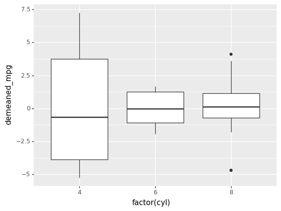

# wrestlr

[](https://mybinder.org/v2/gh/machow/wrestlr/master)

The language wars are over.

wrestlr uses python to do a two step dance:

* parse R code that uses [dplyr](https://github.com/tidyverse/dplyr).
* spit out python code that runs using the dplyr port [siuba](http://github.com/machow/siuba).

## Basic use


```python
import wrestlr

r_code = """
  mtcars %>%
    filter(hp < 200)
"""

wrestlr.rlang_convert(r_code)
```


    mtcars >> filter(_.hp < 200)


It's much nicer to use IPython cell magic, though!


```python
import wrestlr
%load_ext wrestlr
```


```python
%%wrestlr --print
1

'a'

TRUE

NULL

x$y

x[["y"]]
```

    1
    
    'a'
    
    True
    
    None
    
    x.y
    
    x['y']


Here is another example with ggplot.


```python
%%wrestlr --print
mtcars %>%
  select(hp, mpg, cyl) %>%
  ggplot(aes(hp, mpg)) +
  geom_point() +
  facet_wrap(~cyl)
```

    (mtcars >> select(_.hp,_.mpg,_.cyl) >> ggplot(aes('hp','mpg'))) + geom_point() + facet_wrap('~cyl')


## Executing 

Instead of printing code, you can execute it using the `--execute` option. First, we'll import some python functions.


```python
# import wrestlr
# %load_ext wrestlr

import pandas as pd

from siuba import _, mutate, group_by, ungroup
from siuba.data import mtcars

from plotnine import *

def factor(x):
    return pd.Categorical(x)
```

Next we convert and execute the code.


```python
%%wrestlr --print --execute --black

mtcars %>%
  group_by(cyl) %>%
  mutate(demeaned_mpg = mpg - mean(mpg)) %>%
  ungroup() %>%
  ggplot(aes(factor(cyl), demeaned_mpg)) +
  geom_boxplot()

```

    (
        mtcars
        >> group_by(_.cyl)
        >> mutate(demeaned_mpg=_.mpg - _.mpg.mean())
        >> ungroup()
        >> ggplot(aes("factor(cyl)", "demeaned_mpg"))
    ) + geom_boxplot()
    





    <ggplot: (-9223372036554466791)>


## Learning more

See these example notebooks

* [gallery.ipynb](docs/gallery.ipynb)
* [cell_magic.ipynb](docs/cell_magic.ipynb)
* [debugging.ipynb](docs/debugging.ipynb)
* [translate-tidytuesday.ipynb](docs/translate-tidytuesday.ipynb)

